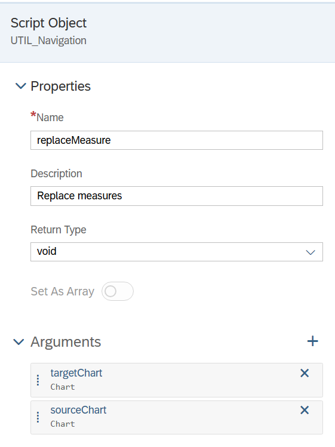

# Create a composite

* Go to Stories on Navigation Bar
* Go to Tab: Composites
* Create a Composite
* Can be created as any other story

<figure><figcaption></figcaption></figure>

<figure><figcaption></figcaption></figure>
